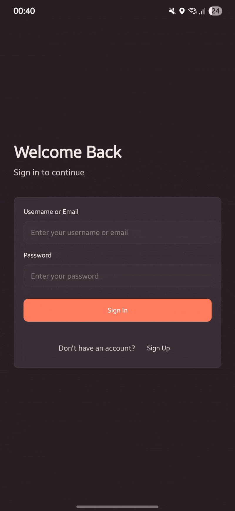
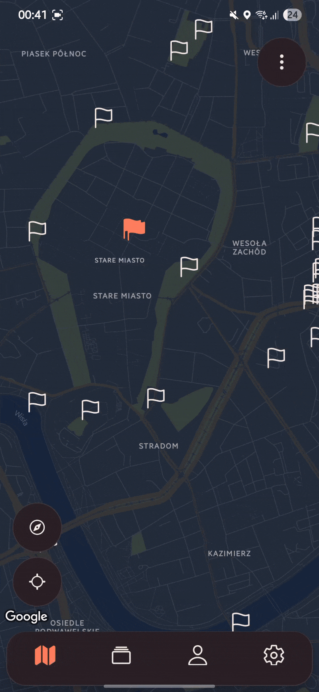
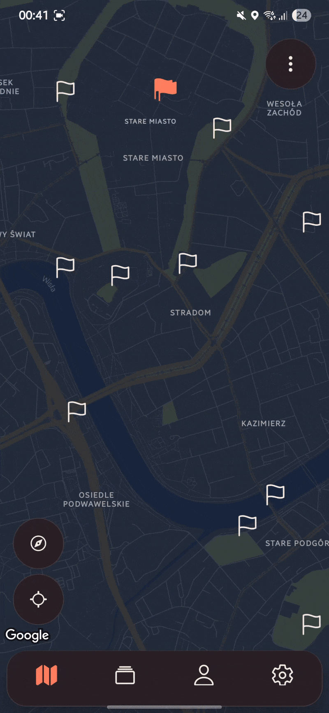
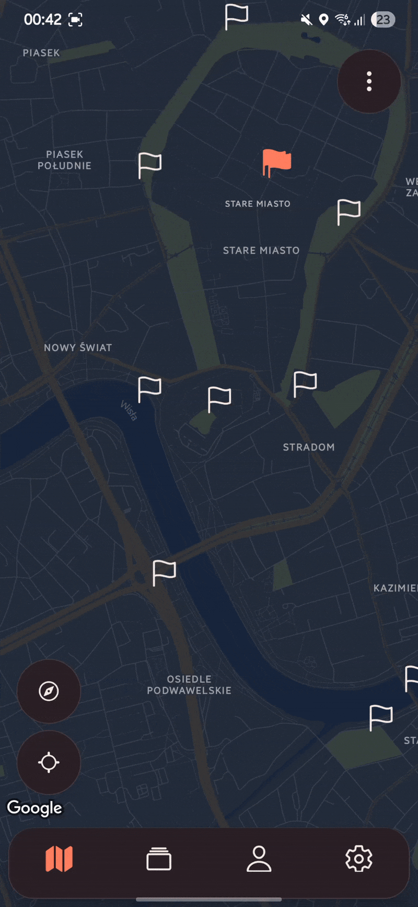
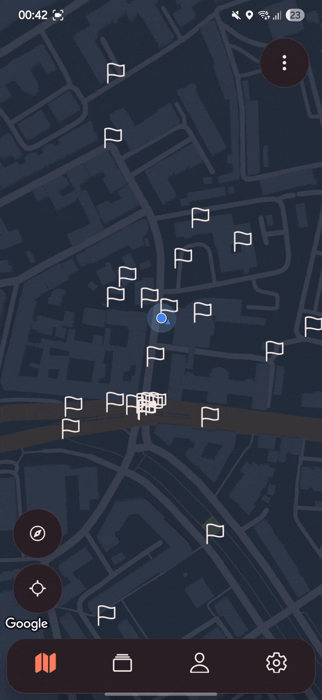
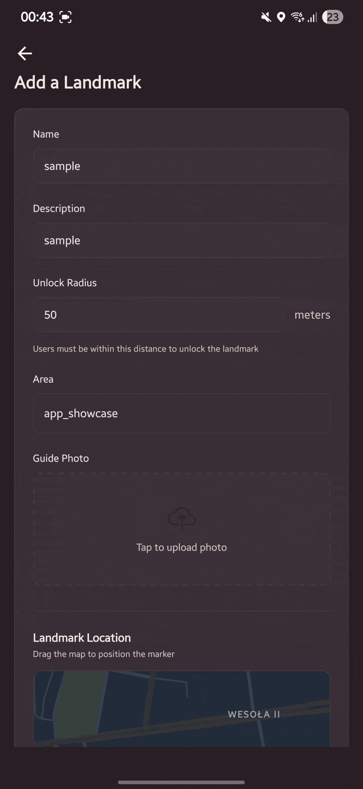
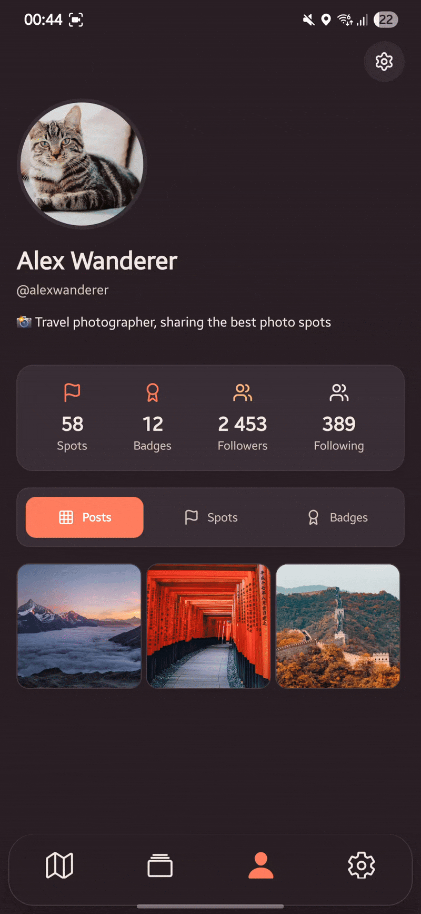
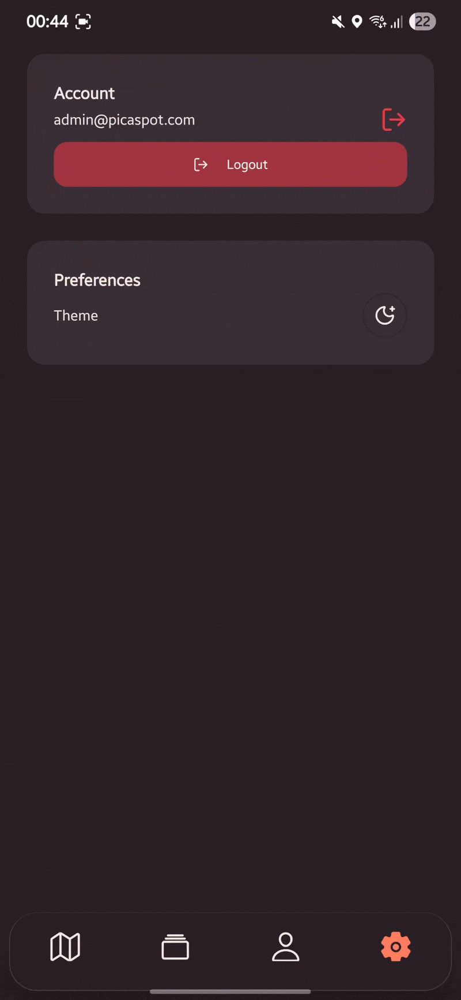

# PicASpot

<div align="center"> <!-- Project Status --> <div> <a href="https://github.com/yehorkarabanov/PicASpot"></a> <a href="LICENSE"></a> <a href="https://github.com/yehorkarabanov/PicASpot"></a> <a href="https://deepwiki.com/yehorkarabanov/PicASpot"></a> </div> <br/> <!-- Technologies --> <div>         </div> </div> <br/> <p align="center"> A location-based gamification platform where users unlock landmarks by taking AI-verified selfies at specific locations. </p>

---

## 📋 Overview

PicASpot is a mobile application that gamifies exploration by challenging users to visit real-world landmarks and verify
their presence through AI-powered photo matching. Using computer vision and geospatial technologies, the app creates an
engaging experience for discovering and collecting locations.

### Key Features

- 🎯 **Location-Based Unlocks**: Visit landmarks and unlock achievements
- 🤖 **AI Photo Verification**: GeoMatchAI validates user photos against Mapillary street view data
- 🗺️ **Geospatial Queries**: Find nearby landmarks and areas using PostGIS
- 👤 **User Profiles**: Track achievements, manage profile pictures, and view unlock history
- 🏆 **Hierarchical Areas**: Organize landmarks into cities, regions, and countries
- 📱 **Mobile-First**: React Native (Expo) app with seamless API integration

---

## 🌟 UI showcase
<p>
  <h3>Login and registration page</h3>
  <br/>
  <h3>Completed landmark</h3>
  <br/>
  <h3>Uncompleted landmark</h3>
  <br/>
  <h3>The map</h3>
  <br/>
  <h3>Map menu</h3>
  <br/>
  <h3>Creating a new landmark</h3>
  <br/>
  <h3>Scroll feed</h3>
  <br/>
  <h3>Profile page</h3>
  <br/>
  <h3>Light color scheme</h3>
  
</p>


---

## 🏗️ Architecture

### Microservices Overview

```
┌─────────────┐      ┌───────────────┐      ┌─────────────┐
│   Frontend  │────▶ │    Nginx      │────▶ │   Backend   │
│ React Native│      │ Reverse Proxy │      │   FastAPI   │
└─────────────┘      └───────────────┘      └──────┬──────┘
                                                   │
                    ┌──────────────────────────────┼─────────────────────────────┐
                    │                              │                │            │
                    ▼                              ▼                ▼            ▼
            ┌───────────────┐            ┌─────────────┐     ┌──────────┐   ┌──────────┐
            │ Apache Kafka  │            │ PostgreSQL  │     │  Redis   │   │  MinIO   │
            │   (3 brokers) │            │  + PostGIS  │     │  Cache   │   │ Storage  │
            └───────┬───────┘            └─────────────┘     └──────────┘   └──────────┘
                    │
        ┌───────────┴───────────┐
        │                       │
        ▼                       ▼
┌─────────────┐         ┌─────────────┐
│Image Service│         │Email Service│
│ GeoMatchAI  │         │    SMTP     │
└─────────────┘         └─────────────┘
```

### Core Services

- **Backend Service**: FastAPI REST API handling authentication, landmarks, areas, and unlocks
- **Image Service**: AI-powered photo verification using GeoMatchAI and Mapillary API
- **Email Service**: Asynchronous email sending for verification and password resets
- **PostgreSQL + PostGIS**: Geospatial database with Geography types for location queries
- **Apache Kafka**: 3-broker message streaming cluster for inter-service communication
- **Redis**: Distributed caching, rate limiting, and session management
- **MinIO**: S3-compatible object storage for images
- **Nginx**: Reverse proxy and API gateway

---

## 🛠️ Technology Stack

### Backend

- **FastAPI** - Modern async Python web framework
- **SQLAlchemy 2.0** - Async ORM with declarative models
- **Alembic** - Database migrations
- **PostGIS** - Geospatial extensions for PostgreSQL
- **Pydantic V2** - Data validation and serialization
- **aiokafka** - Async Kafka client
- **GeoMatchAI** - Computer vision for location verification
- **MinIO Python SDK** - Object storage client

### Frontend

- **React Native** - Cross-platform mobile framework
- **Expo** - Development and build tooling
- **NativeWind** - Tailwind CSS for React Native
- **React Native Reusables** - UI component library

### Infrastructure

- **Docker & Docker Compose** - Container orchestration
- **Nginx** - Reverse proxy and load balancing
- **Apache Kafka** - Distributed message streaming
- **Redis** - In-memory data store
- **PostgreSQL 16** - Primary database
- **MinIO** - Object storage

---

## 🚀 Getting Started

### Prerequisites

- Docker and Docker Compose
- Node.js 18+ and npm
- Mapillary API key ([Get one here](https://www.mapillary.com/developer))

### Installation

1. **Clone the repository**

```bash
git clone https://github.com/yehorkarabanov/PicASpot.git
cd PicASpot
```

2. **Configure environment variables**

Create a `.env` file in the root directory:

```bash
MAPILLARY_API_KEY=your_mapillary_api_key_here
POSTGRES_PASSWORD=your_secure_password
JWT_SECRET_KEY=your_jwt_secret_key
```

3. **Start the backend services**

```bash
docker-compose up -d
```

This will start all backend services:

- Backend API (port 8000)
- PostgreSQL + PostGIS (port 5432)
- Redis (port 6379)
- Kafka cluster (ports 9092-9094)
- MinIO (port 9000)
- Nginx reverse proxy (port 80)
- Image verification service
- Email service

4. **Install frontend dependencies**

```bash
cd src/frontend
npm install
```

5. **Detect backend server IP** (Windows)

```bash
npm run predev
```

> **Note**: This script automatically detects your server IP and configures the API URL. For other operating systems,
> manually update the API endpoint in the frontend configuration.

6. **Start the frontend development server**

```bash
npm run dev
```

7. **Run the app**

- **iOS**: Press `i` to launch in iOS simulator (Mac only)
- **Android**: Press `a` to launch in Android emulator
- **Web**: Press `w` to run in browser
- **Physical Device**: Scan the QR code with Expo Go app

---

## 📡 API Documentation

Once the backend is running, interactive API documentation is available:

- **Swagger UI**: http://localhost/api/docs
- **ReDoc**: http://localhost/api/redoc
- **OpenAPI Schema**: http://localhost/api/openapi.json

### API Endpoints

#### Authentication

- `POST /api/v1/auth/register` - Register new user
- `POST /api/v1/auth/login` - Login and get JWT token
- `POST /api/v1/auth/verify-email` - Verify email address
- `POST /api/v1/auth/reset-password` - Reset password

#### Users

- `GET /api/v1/user/me` - Get current user profile
- `PATCH /api/v1/user/me` - Update user profile
- `POST /api/v1/user/me/profile-picture` - Upload profile picture

#### Areas

- `POST /api/v1/area` - Create new area
- `GET /api/v1/area/{area_id}` - Get area details
- `GET /api/v1/area/nearby` - Find nearby areas

#### Landmarks

- `POST /api/v1/landmark` - Create new landmark
- `GET /api/v1/landmark/{landmark_id}` - Get landmark details
- `GET /api/v1/landmark/nearby` - Find nearby landmarks
- `POST /api/v1/landmark/{landmark_id}/unlock` - Attempt to unlock

#### Unlocks

- `GET /api/v1/unlock/me` - Get user's unlocks
- `GET /api/v1/unlock/feed` - Get global unlock feed

---

## 🔧 Configuration

### Environment Variables

#### Backend Service

```env
# Database
POSTGRES_HOST=postgres
POSTGRES_PORT=5432
POSTGRES_DB=picaspot
POSTGRES_USER=postgres
POSTGRES_PASSWORD=your_password

# Redis
REDIS_HOST=redis
REDIS_PORT=6379
REDIS_PASSWORD=your_redis_password

# JWT
JWT_SECRET_KEY=your_jwt_secret
JWT_ALGORITHM=HS256
ACCESS_TOKEN_EXPIRE_MINUTES=30

# MinIO
MINIO_ENDPOINT=minio1:9000
MINIO_ROOT_USER=minioadmin
MINIO_ROOT_PASSWORD=minioadmin
MINIO_BUCKET_NAME=picaspot-storage

# Kafka
KAFKA_BOOTSTRAP_SERVERS=kafka-0:9092,kafka-1:9092,kafka-2:9092
```

#### Image Service

```env
# GeoMatchAI
GEOMATCH_SIMILARITY_THRESHOLD=0.65
GEOMATCH_DEVICE=cuda  # cuda, cpu, or auto
GEOMATCH_MODEL_TYPE=timm
GEOMATCH_MODEL_VARIANT=tf_efficientnet_b4.ns_jft_in1k

# Mapillary
MAPILLARY_API_KEY=your_mapillary_key
```

---

## 🗄️ Database Schema

### Core Models

#### User

- UUID-based primary key
- Username and email (unique, indexed)
- Hashed password with bcrypt
- Email verification status
- Superuser flag
- Profile picture URL
- Timestamps (created_at, updated_at)

#### Area

- Hierarchical geographic regions (self-referencing parent)
- Name, description, image, and badge URLs
- Creator reference and verification flag
- PostGIS Geography type for boundaries
- Relationships: child areas, landmarks

#### Landmark

- Points of interest with coordinates (PostGIS Geography)
- Area reference, difficulty rating, points value
- Image and hint image URLs
- Photo location with radius for verification
- Relationships: unlocks, attempts

#### Unlock

- User achievement records
- Landmark and user references
- Unlock timestamp and photo URL
- Similarity score from AI verification
- Feed visibility flag

#### Attempt

- Temporary verification requests (5-minute TTL)
- User, landmark, and photo references
- Status: PENDING, APPROVED, REJECTED
- Linked to final unlock on approval

---

## 🤖 AI Verification Flow

1. **User submits photo** at landmark location via mobile app
2. **Backend validates** location proximity and creates Attempt record
3. **Backend publishes** message to Kafka topic `image-verify-requests`
4. **Image Service consumes** message and downloads photo from MinIO
5. **GeoMatchAI verifies** photo against Mapillary street view data
    - Fetches reference images from Mapillary API
    - Uses EfficientNet B4 model for feature extraction
    - Computes similarity score (threshold: 0.65)
6. **Image Service publishes** result to `image-verify-results` topic
7. **Backend consumes** result and creates Unlock or rejects Attempt
8. **User receives** notification of success/failure

---

## 📦 Project Structure

```
PicASpot/
├── src/
│   ├── backend/                 # FastAPI backend service
│   │   ├── app/
│   │   │   ├── area/           # Area domain
│   │   │   ├── auth/           # Authentication
│   │   │   ├── core/           # Core utilities
│   │   │   ├── database/       # Database config & migrations
│   │   │   ├── kafka/          # Kafka producers/consumers
│   │   │   ├── landmark/       # Landmark domain
│   │   │   ├── middleware/     # Custom middleware
│   │   │   ├── storage/        # MinIO integration
│   │   │   ├── unlock/         # Unlock domain
│   │   │   ├── user/           # User domain
│   │   │   ├── main.py         # FastAPI app entry
│   │   │   └── settings.py     # Configuration
│   │   └── tests/              # Test suite
│   ├── image-service/          # AI verification service
│   │   ├── app/
│   │   │   ├── kafka/          # Kafka integration
│   │   │   ├── storage/        # MinIO client
│   │   │   ├── verification/   # GeoMatchAI integration
│   │   │   └── main.py
│   │   └── Dockerfile
│   ├── image-service-dev/      # Mock verification (dev mode)
│   ├── email-service/          # Email sending service
│   ├── frontend/               # React Native mobile app
│   │   ├── app/                # Expo Router screens
│   │   ├── components/         # Reusable components
│   │   ├── lib/                # Utilities and API client
│   │   └── assets/             # Images and fonts
│   ├── backup/                 # Database backup scripts
│   └── nginx/                  # Nginx configuration
├── docker-compose.yaml         # Service orchestration
├── .env.example                # Environment template
└── README.md
```

---

## 🧪 Testing

### Backend Tests

```bash
# Run all tests
docker-compose exec backend pytest

# Run with coverage
docker-compose exec backend pytest --cov=app --cov-report=html

# Run specific test file
docker-compose exec backend pytest tests/unit/test_auth.py
```

### Test Coverage

- Unit tests for business logic
- Integration tests for API endpoints
- Database fixtures with in-memory SQLite
- Mock external services (Kafka, MinIO, Redis)

---

## 🔐 Security Features

- **JWT Authentication**: Secure token-based authentication with refresh tokens
- **Password Hashing**: Bcrypt with configurable rounds
- **Rate Limiting**: Redis-backed rate limiting on authentication endpoints
- **Input Validation**: Pydantic models with custom validators
- **SQL Injection Prevention**: SQLAlchemy parameterized queries
- **CORS Configuration**: Configurable allowed origins
- **File Upload Validation**: File type, size, and content validation
- **UUID-based Filenames**: Prevents path traversal attacks
- **Pre-signed URLs**: Temporary access to MinIO objects
- **Sensitive Data Filtering**: Automatic redaction in logs

---

## 📊 Monitoring & Observability

### Health Checks

The backend provides a comprehensive health check endpoint:

```bash
GET /health
```

Response:

```json
{
  "status": "healthy",
  "checks": {
    "redis": true,
    "database": true,
    "minio": true,
    "kafka": true
  }
}
```

### Logging

- **Structured JSON Logging**: In production mode
- **Human-Readable Logs**: In development mode
- **Service-Specific Logs**: Separate log files per service
- **Async Queue Logging**: Non-blocking I/O operations
- **Sensitive Data Redaction**: Automatic filtering of passwords, tokens, API keys

### Metrics

- Request duration tracking
- Status code distribution
- Database connection pool stats
- Kafka consumer lag monitoring

---

## 🗄️ Backup & Restore

Interactive backup manager for PostgreSQL:

```bash
# Access backup shell
docker exec -it backup /backup/backup.sh

# Create backup (non-interactive)
docker-compose exec backup /backup/backup.sh backup

# List backups
docker-compose exec backup /backup/backup.sh list

# Restore backup
docker-compose exec backup /backup/backup.sh restore <filename>
```

Backups are stored in `./backups` directory with timestamped filenames.

---

## 🚢 Deployment

### Docker Production Build

```bash
# Build all services
docker-compose -f docker-compose.prod.yaml build

# Start services
docker-compose -f docker-compose.prod.yaml up -d

# View logs
docker-compose logs -f backend
```

---

## 🤝 Contributing

Contributions are welcome! Please follow these steps:

1. Fork the repository
2. Create a feature branch (`git checkout -b feature/amazing-feature`)
3. Commit your changes (`git commit -m 'Add amazing feature'`)
4. Push to the branch (`git push origin feature/amazing-feature`)
5. Open a Pull Request

### Code Style

- **Backend**: Follow PEP 8, use `ruff` for linting
- **Frontend**: Follow Airbnb style guide, use ESLint
- **Commits**: Use conventional commits (feat:, fix:, docs:, etc.)

---

## 📝 License

This project is licensed under the MIT License - see the LICENSE file for details.

---

## 👥 Team

- **Denys Shevchenko** - Project Lead, Architecture, Docker Orchestration, MinIO, GeoMatchAI, Nginx Configuration
- **Yehor Karabanov** - Backend Development, Database Design, API Implementation
- **Krzysztof Kozak** - Frontend Development, Mobile UI/UX, React Native Implementation

---

## 🙏 Acknowledgments

- [GeoMatchAI](https://github.com/LilConsul/geomatchai) - Computer vision for location verification
- [Mapillary API](https://www.mapillary.com/) - Street-level imagery data
- [FastAPI](https://fastapi.tiangolo.com/) - Modern Python web framework
- [Expo](https://expo.dev/) - React Native development platform
- [PostGIS](https://postgis.net/) - Spatial database extension

---

<div align="center">

Made with ❤️ by the PicASpot Team

[Report Bug](https://github.com/yehorkarabanov/PicASpot/issues) · [Request Feature](https://github.com/yehorkarabanov/PicASpot/issues)

</div>
